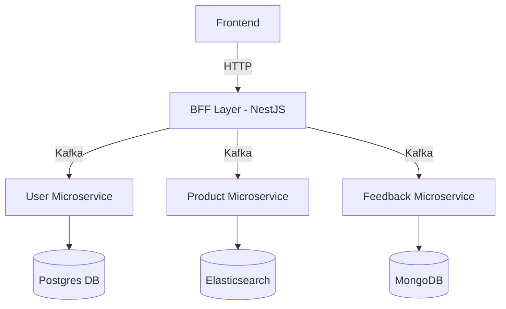

<div align="center">
	<h1>🚀 MicroRentXPlatform is an extensive boiler plate for peer-to-peer Rental Microservices Platform </h1>
	<p>
		
		
		
	</p>
	<h3>Modern, Scalable, and Flexible Microservices Boilerplate</h3>
</div>

> **A production-ready, event-driven microservices architecture for peer-to-peer rental platforms, built with [NestJS](https://docs.nestjs.com/), [Kafka](https://kafka.apache.org/documentation/), and Docker.**

---

## ✨ Overview

This project is a robust boilerplate for building scalable, maintainable, and cloud-ready peer-to-peer rental platforms. It leverages:

- **BFF (Backend For Frontend) Layer**: Central API gateway for authentication, routing, and orchestration.
- **Domain-Driven Microservices**: User, Product, and Feedback services, each with its own database and business logic.
- **Event-Driven Communication**: Powered by Kafka for decoupled, resilient messaging.
- **Polyglot Persistence**: Each service can use the database best suited for its needs (Postgres, MongoDB, Elasticsearch, etc.).
- **Dockerized Databases**: Easy local development and zero-cost infrastructure.

---

## 🏗️ Architecture



- **BFF Layer**: Handles all HTTP requests, authentication, and hides microservices from the frontend.
- **Microservices**: Each service listens to Kafka topics, processes messages, and manages its own data.
- **Kafka**: Central message broker for asynchronous, decoupled communication.
- **Databases**: Each service uses the most suitable database for its domain.

---

## 🌟 Why Use This Boilerplate?

- **🔒 Security**: BFF pattern ensures microservices are never exposed directly to the frontend.
- **🧩 Modularity**: Each service is independent, making it easy to extend or replace.
- **⚡ Performance**: Kafka enables high-throughput, low-latency communication.
- **🛠️ Polyglot Persistence**: Use the best database for each domain ([Postgres](https://www.postgresql.org/), [MongoDB](https://www.mongodb.com/), [Elasticsearch](https://www.elastic.co/elasticsearch/)).
- **🐳 Zero-Cost Local Dev**: All infrastructure (Kafka, DBs) runs locally via Docker—no cloud costs.
- **☁️ Cloud-Ready**: Easily extend to Kubernetes, AWS, GCP, or Azure.
- **🧹 Clean Architecture**: Follows SOLID, separation of concerns, and domain-driven design principles.
- **📈 Scalable**: Add new microservices or swap databases with minimal changes.

---

## 🧑‍💻 Technologies Used

- [NestJS](https://docs.nestjs.com/) — Progressive Node.js framework
- [Kafka](https://kafka.apache.org/documentation/) — Distributed event streaming
- [Docker](https://docs.docker.com/) — Containerization
- [PostgreSQL](https://www.postgresql.org/), [MongoDB](https://www.mongodb.com/), [Elasticsearch](https://www.elastic.co/elasticsearch/) — Databases
- [TypeScript](https://www.typescriptlang.org/) — Type safety

---

## 💡 Key Features & Benefits

> "The best architectures are those that are easy to change and scale."

- **BFF Layer**: Centralizes authentication, validation, and API orchestration.
- **Microservices**: Each service is responsible for a single domain, following separation of concerns.
- **Event-Driven**: Kafka decouples services, enabling async processing and resilience.
- **Polyglot Databases**: Each service can use the optimal database for its needs.
- **Dockerized**: All databases and Kafka run locally with Docker Compose for easy setup.
- **Extensible**: Add new services or swap technologies with minimal friction.
- **Cloud-Ready**: Easily migrate to cloud platforms or orchestrate with Kubernetes.

---

## 🚀 Getting Started

### 1. Clone the Repository

```bash
# Using HTTPS
git clone https://github.com/usman250994/Nestjs-microservices_peer_2_peer_rental_project.git
cd Nestjs-microservices_peer_2_peer_rental_project
```

### 2. Start Kafka and Zookeeper

```bash
docker-compose up -d
```
- This will start Kafka, Zookeeper, and Kafka UI locally. No cloud costs!
- For more, see [Kafka Docker Docs](https://docs.confluent.io/platform/current/installation/docker/index.html).

### 3. Start Databases for Each Microservice

- Each microservice (`user_management`, `product_management`, `feedback_management`) has its own `docker-compose.yml` for its database.
- In each service folder, run:

```bash
docker-compose up -d
```

### 4. Start the BFF and Microservices

- In separate terminals, run the following for each service and the BFF:

```bash
npm install
npm run start:dev
```

### 5. Access Kafka UI

- Visit [http://localhost:8080](http://localhost:8080) to monitor Kafka topics and messages.

---

## 🧭 Extending & Deploying

- **Add New Microservices**: Scaffold a new NestJS service, connect it to Kafka, and add its DB via Docker.
- **Cloud Deployment**: Containerize services and deploy to [Kubernetes](https://kubernetes.io/), [AWS ECS](https://aws.amazon.com/ecs/), [GCP Cloud Run](https://cloud.google.com/run), or [Azure AKS](https://azure.microsoft.com/en-us/products/kubernetes-service/).
- **Monitoring**: Integrate [Prometheus](https://prometheus.io/) and [Grafana](https://grafana.com/) for observability.
- **CI/CD**: Use [GitHub Actions](https://github.com/features/actions) or [GitLab CI](https://docs.gitlab.com/ee/ci/) for automation.

---

## 🧠 Learn More

- [NestJS Docs](https://docs.nestjs.com/)
- [Kafka Docs](https://kafka.apache.org/documentation/)
- [Docker Docs](https://docs.docker.com/)
- [PostgreSQL Docs](https://www.postgresql.org/docs/)
- [MongoDB Docs](https://www.mongodb.com/docs/)
- [Elasticsearch Docs](https://www.elastic.co/guide/en/elasticsearch/reference/current/index.html)

---

## 🎨 Portfolio-Ready

> "A clean, scalable, and modern microservices boilerplate for real-world projects and portfolios."

- **Fork and adapt** for your own SaaS, marketplace, or event-driven platform.

---

## 🌐 Connect with the Author

- [ LinkedIn](https://www.linkedin.com/in/usman-ali-siddiqui-744585132/)
- [ Medium](https://medium.com/@mani9418)

---

<div align="center">
	
	<b>Made with ❤️ using NestJS, Kafka, and Docker</b>
</div>
